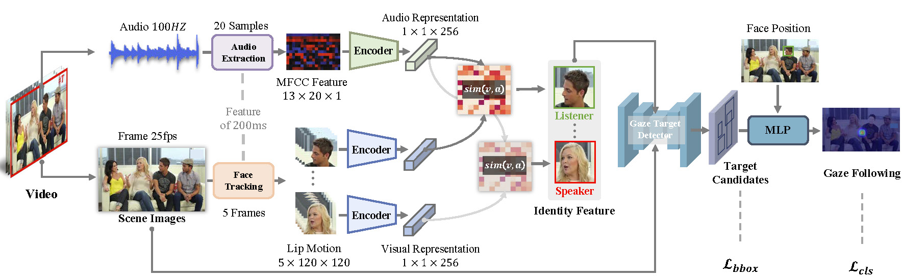

# Gaze Following in Video with Speeches


## Overview


Gaze following estimates gaze targets of in-scene person by understanding human behavior and scene information. Existing methods usually analyze scene images for gaze following. However, compared with visual images, audio also provides crucial cues for determining human behavior. This suggests that we can further improve gaze following considering audio cues. In this research, we explore gaze following tasks in conversational scenarios. We propose a novel multi-modal gaze following framework based on our observation ``audiences tend to focus on the speaker''. We first leverage the correlation between audio and lips, and classify speakers and listeners in a scene. We then use the identity information to enhance scene images and propose a gaze candidate estimation network. The network estimates gaze candidates from enhanced scene images and we use MLP to match subjects with candidates as classification tasks.Existing gaze following datasets focus on visual images while ignore audios.To evaluate our method, we collect a conversational dataset, VideoGazeSpeech (VGS), which is the first gaze following dataset including images and audio. Our method significantly outperforms existing methods in VGS datasets. The visualization result also prove the advantage of audio cues in gaze following tasks. Our work will inspire more researches in multi-modal gaze following estimation.



## Folder Structure:
```
-KETI_VGS
    --configs
        ---Mask_RCNN
            ----requirement.txt
            ----environment.yaml
        ---Speaker_detector
            ----requirement.txt

 --data:
    Note: This folder you can find:
            (1) Sequence_Gaze_Frames: Sequence gaze frames information generated by VGS: csv file and frames. 
            (2) head_box: Head boxes data generated by VGS. 
            (3) GT_VGS_Frames: The whole VGS datasetVGS's GroundTruth in 2 differenct format(coco, videoattention).
            (4) Raw_Video: Raw videos (with audio) in VGS

    Details are as follows:

    ---(1) Sequence_Gaze_Frames
        Note: csv format:  [frame_name,head_x,head_y,gazetarget_xmin,gazetarget_ymin,gazetarget_xmax,gazetarget_ymax]
        frame_name format：imageID+FrameSeqID.jpg = 0742480.jpg


    ---(2) head_box [here](https://drive.google.com/drive/folders/1gUFw-mG9kU_I9R1f-N_y1LlLGwmCThPR?usp=sharing)


    ---(3) GT_VGS_Frames
        Note: The frames with ground truth (gaze target labelling) in sequence for each videos in VGS dataset

        ----coco_GT_VGS_Frames
        Note: This is the VGS database formatted for coco, including ground truth bbox as input:
        eg: (image_name, xmin,ymin,xmax,ymax): (0271006.jpg,192,120,454,382)
        Dataset can be download in this link: 
        (Train/val/test dataset: coco-HS.zip, coco-H.zip, coco-noHnoS.zip
        GT label xml files: GT_label_all.zip):[here](https://drive.google.com/drive/folders/14txFPMU-yV1RyXhGXTGLJtj-urZD5CC2?usp=sharing)
        
        
        ----videoattentionFormat_GT_VGS_Frames
        Note: This is the VGS database formatted for VideoAttention Algorithms [ref](https://github.com/ejcgt/attention-target-detection), including ground truth bbox and head information as input: 
        eg: (image_name, xmin,ymin,xmax,ymax,head_x,head_y): (0271006.jpg,192,120,454,382,375,235)

        Dataset can be download in this link:[here](https://drive.google.com/drive/folders/1BEvRF7jWM0P_u_6rsND_mTOXao6l5gZ3?usp=share_link)

    ---(4) Raw_Video [here](https://drive.google.com/drive/folders/1g3scSCQrOKcbDFuPH83CTdQM8PR25o3o?usp=sharing)


 --utils
    ---Speaker_detector : Align multimodal (video + audio) to detect speaker and non-speaker, generate head box of speaker and non-speaker.
    ---Mask_RCNN : Detect gaze target boxes in the frame.
    

 --weights:
   Note: 
   Mask_RCNN's checkpoint is [here]
   Speaker_Detecter's checkpoint is [here]

Data_Preprocessing.py----Prepare data
MLP_Best_Gaze.py--generate final gaze point

README.md
```


## Getting Started
You can follow the Demo.sh to explore our project.

The environment requirment file can be found in ./configs, there are 2 different environment files for Mask_RCNN and Speaker_Detector. You can directly use file environment.yaml, or use 
```
pip install -r requirments.txt 
```
to download libraries.


## Experiment on the VGS dataset
### Dataset
You can download the VGS dataset from [here](https://drive.google.com/drive/folders/1RJT34bpPtuXwKwohcpVjZ8jOf8XKUXK1?usp=sharing).

If you want to try your own dataste. Please adjust the dataset format into coco format.

### Step1: Split videos into sequences(frames)
```
python Data_Preprocessing.py --videoPath ./data/Raw_Video/videos/012.mp4  --imgPath ./output/image_frame/012
```

### Step2: Go to folder './utils/Speaker_detector', By fusion audio&video to detect speakers, here we use pre-trained model for speaker dectection

```
sh build_face_map_Generate_FaceMap.sh ../../data/Raw_Video/videos/002.mp4  002 ../../data/output/speaker_detect/
```

### Step3: Go to folder './utils/Mask_RCNN/'. Train VGS model to detect gaze points. If you use pre_trained checkpoint ([here](https://drive.google.com/drive/folders/1gcACzyd_8tXTU4HsVNFLyC0_ZBCd7iwm?usp=sharing) )directly, please skip this step.

Run:

(1) If you have more than 1 GPU:
```
Python  ./tools/dist_train.sh yuqi_x101_32x4d_fpn_1x_HS/mask_rcnn_x101_32x4d_fpn_1x_coco.py  2
```

(2) If you only have one GPU:
```
Python  ./tools/train.py yuqi_x101_32x4d_fpn_1x_HS/mask_rcnn_x101_32x4d_fpn_1x_coco.py
```

#mask_rcnn_x101_32x4d_fpn_1x_coco.py privides parameters to tuning the newwork, you can do some customized changes on it.


### Step4: Go to folder './utils/Mask_RCNN/'. Detect gaze points from Mask_RCNN
```
python ./tools/test_yuqi.py
```

### Step5: Go to home folder. Use MLP [checkpoint]() to detect best gaze point.

```
python MLP_Best_Gaze.py
```

In this step you will generate the final csv file [here](https://drive.google.com/file/d/1JBDwW9fbwGz-gl2hzAI9voNz3PR9Rf0T/view?usp=sharing).


## Contact
If you have any questions, please email Yuqi Hou at houyuqi21701@gmail.com
